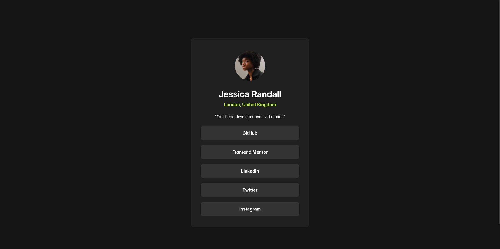

# Frontend Mentor - Solução do Desafio "Social Links Profile"

Esta é a minha solução para o [desafio "Social Links Profile" do Frontend Mentor](https://www.frontendmentor.io/challenges/social-links-profile-UG32l9m6dQ).

## Visão Geral

### Screenshot

### Links

- **URL da Solução:** [Link para o repositório no GitHub](https://github.com/pfrigeri/social-links-profile)
- **URL do Site:** [Link para o site no ar](https://pfrigeri.github.io/social-links-profile/)

---

## Meu Processo

### Construído com

- HTML5 Semântico
- CSS Custom Properties (Variáveis)
- Flexbox

### O que eu aprendi

Este projeto foi uma ótima oportunidade para colocar em prática os conceitos de Flexbox. O principal desafio foi entender como `flex-direction: column` inverte o comportamento dos eixos, fazendo com que `align-items` controle o alinhamento horizontal. Além disso, foi um excelente exercício para seguir um design com precisão, ajustando fontes, cores e espaçamentos para chegar o mais perto possível do layout proposto.

### Recursos Úteis

- [The Odin Project](https://www.theodinproject.com/lessons/foundations-alignment) - Esta aula me introduziu ao conceito de Flexbox e seus diversos comportamentos.
- [Guia Interativo de Flexbox](https://www.joshwcomeau.com/css/interactive-guide-to-flexbox/) - Artigo incrível com exemplos interativos que me ajudaram a visualizar como `flex-direction` afeta as regras `justify-content` e `align-items`.

---

## Autor

- **LinkedIn** - [Pedro Moura Frigeri](https://www.linkedin.com/in/pedro-moura-frigeri/)
